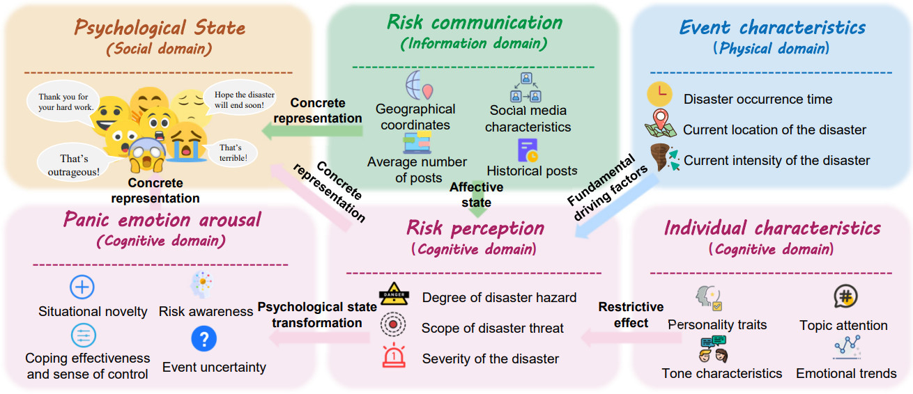
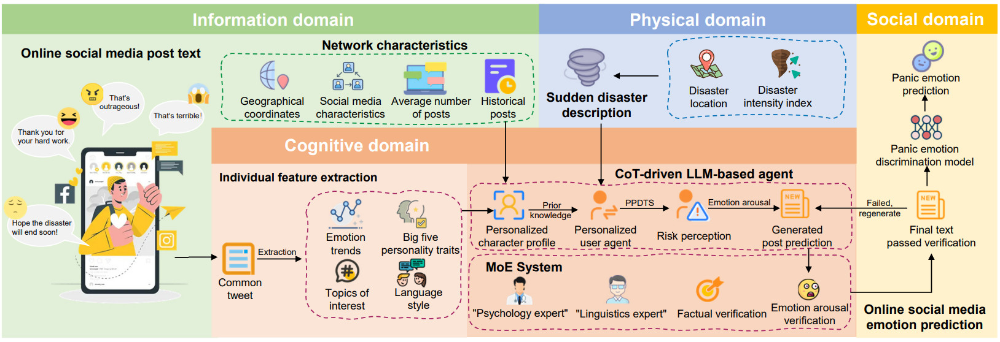
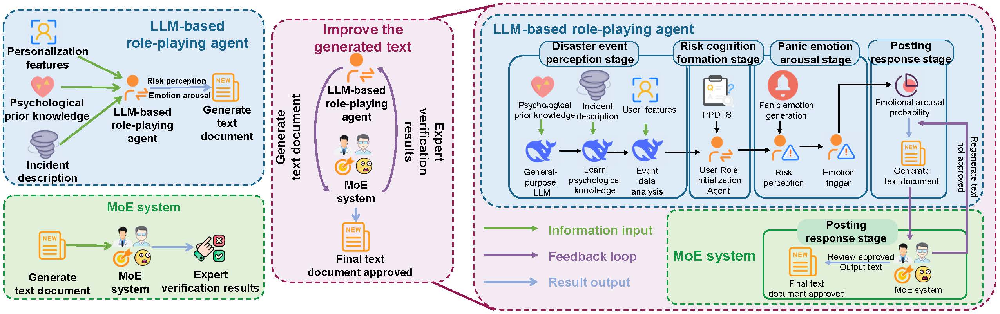

# PsychoAgent: Psychology-driven LLM Agents for Explainable Panic Prediction

## :house: Introduction

Social media accelerates the spread of extreme emotions during sudden events, yet its real-time nature, rich information content, and spatiotemporal granularity offer unique opportunities for emotion prediction and management. Among various negative emotions, uncontrolled panic can exhaust emergency resources, trigger secondary disasters, even escalate isolated hazards into complex societal crises.

This repository accompanies our research paper titled "Psychology-driven LLM Agents for Explainable Panic Prediction on Social Media during Sudden Disaster Events." In this repository, we propose a Psychology-driven generative Agent framework(PsychoAgent) for panic emotion prediction during sudden disasters. Moreover, this work shows signiffcant implications for developing explainable AI systems capable of providing deeper insights into collective emotional dynamics during sudden disaster events.

## :star: Contributions

> ⭐ To support panic prediction, we pioneer a novel dual-phase panic emotion annotation dataset. We also fine-tune a discriminator to detect panic signals in generated texts.
> ⭐ We innovatively propose a psychology-driven, multi-domain fusion mental model for public panic prediction during disasters. Our approach integrates multi-domain data via an LLM-based role-playing agent for interpretable psychological modeling of panic formation mechanisms.
> ⭐ Experimental results show that the proposed framework achieves an accuracy of 86% (↑ at least 13% versus SOTA) in panic emotion prediction task. Moreover, scalability studies and case studies further validate the explainability and generalization of our approach.

-----

- [COPE Dataset Benchmark](#cope-dataset-benchmark)
- [BERT Model Training Effect](#bert-model-training-effect)
- [Psychology-Driven LLM Agent Framework](#psychology-driven-llm-agent-framework)
- [CoT-driven LLM-based agent](#cot-driven-llm-based-agent)

## COPE Dataset Benchmark

To address the gap in high-quality panic emotion resources, we develop the first fine-grained dataset COPE, spanning pre- and post-disaster phases, which fills the gap in standardized panic emotion datasets and provides a foundation for advancing research in emotion prediction and related fields. Statistical details of the dataset
is presented as follows. 

| Category                  | Quantity    |
|---------------------------|-------------|
| Panic User Count          | 3,240       |
| Non-Panic User Count      | 5,825       |
| **Total Users**           | **9,065**   |
| Pre-Disaster Tweet Count  | 242,363     |
| Post-Disaster Tweet Count | 1,142,626   |
| **Total Tweets**          | **1,384,989** |

First, we extract four key features from each user's pre - disaster data: the Five - Factor Model personality traits, topics of interest, emotional trends, and tone characteristics. 

Focusing on panic prediction during sudden disasters, our dataset centers on post-disaster texts with panic emotion annotations. Then, using human - LLM collaborative labeling on a small amount of data and fine - tuning a BERT model, we automatically label post - disaster posts for panic - related content. The "one-veto principle" is applied to identify users showing panic.

Finally, we split the COPE dataset into two parts: one for users' pre - disaster posts and another for users' individual features, including the panic - user label.

The annotated dataset is located in the COPE folder within the datafiles directory. We store pre-disaster and post-disaster data separately for each user:

* 📖 cleaned_Formed_data.csv contains pre-disaster data for each user;
* 📖 panic_disaster_data.csv contains per-user post-disaster data, with each post labeled for panic emotion;
* 📖 merged_user_files.csv contains user characteristic data for all 9,065 users.

For experimental consistency with baseline methods (which use 80% for training and 20% for testing), this study uses the same 20% test dataset. Therefore:
* 📖 merged_user_files_1.csv contains the identical 20% user subset used in baseline method testing

The specifications of these two dataset files are shown below.

### cleaned_Formed_data.csv File Fields
| Field Name              | Description                                                                 |
|-------------------------|-----------------------------------------------------------------------------|
| tweet_id                | Unique identifier for the tweet                                             |
| text                    | Content of the post                                                         |
| created_at              | Timestamp of when the post was published                                    |
| user_id                 | Unique identifier for the user                                              |
| user_followers_count    | Number of followers the user has                                            |
| user_friends_count      | Number of friends/connections the user has                                  |
| sentiment_ground_truth  | Ground truth sentiment classification (positive/negative/neutral)           |
| lat_final               | Latitude coordinate of the user's location                                  |
| lng_final               | Longitude coordinate of the user's location                                 |
| panic_related               | Label indicating whether the text post contain a panic emotion(binary classification)                                 |

### merged_user_files.csv / merged_user_files_1.csv File Fields
| Field Name               | Description                                                                 |
|--------------------------|-----------------------------------------------------------------------------|
| user_id                  | Unique identifier for the user                                              |
| user_followers_count     | Number of followers the user has                                            |
| user_friends_count       | Number of friends/connections the user has                                  |
| lat_final                | Latitude coordinate of the user's location                                  |
| lng_final                | Longitude coordinate of the user's location                                 |
| user_event_attitude      | User's attitude toward similar disaster events                              |
| sentiment_trend          | User's pre-disaster sentiment trend                                         |
| topic                    | Topics the user focused on before the disaster                              |
| Extroversion             | User's extroversion level (Big Five personality dimension)                  |
| Neuroticism              | User's neuroticism level (Big Five personality dimension)                   |
| Agreeableness            | User's agreeableness level (Big Five personality dimension)                 |
| Conscientiousness        | User's conscientiousness level (Big Five personality dimension)             |
| Openness                 | User's openness level (Big Five personality dimension)                      |
| tone_of_voice            | Tone characteristics in user's pre-disaster posts                           |
| text_average_count       | User's average daily post count before the disaster                         |
| panic_user               | Label indicating whether the user is a panic user (binary classification)   |

Additionally, we store the intensity data for Hurricane Sandy in an Excel file named hurricane_weather_data_1.xlsx within the datafiles folder. The details of this dataset are as follows:

| Field Name     | Description                     |
|----------------|---------------------------------|
| time           | Timestamp of measurement        |
| category       | Hurricane category level        |
| wind           | Wind speed (units)              |
| air_pressure   | Atmospheric pressure (units)    |
| lat_final      | Latitude coordinate             |
| lng_final      | Longitude coordinate            |

## BERT Model Training Effect

We fine-tuned a BERT model on an augmented and balanced dataset for auto-labeling remaining data, which also provide a reliable benchmark tool for subsequent emotion discrimination in generated texts. To validate training efficacy, we tested the model on both the augmented dataset and the original human-verified dataset, with results demonstrating robust performance even on non-augmented data, confirming the effectiveness of our EDA enhanced training strategy. The parameter files of our fine-tuned BERT model are stored in the modelFiles folder.

### BERT Model Performance on Augmented Training Data
| Metric         | Precision | Recall | F1-score | Support |
|----------------|-----------|--------|----------|---------|
| No Panic       | 1.00      | 0.99   | 0.99     | 513     |
| Panic          | 0.99      | 1.00   | 0.99     | 497     |
| Accuracy       |           |        | 0.99     | 1010    |
| Macro Avg      | 0.99      | 0.99   | 0.99     | 1010    |
| Weighted Avg   | 0.99      | 0.99   | 0.99     | 1010    |

### BERT Model Performance on Original Imbalanced Test Data
| Metric         | Precision | Recall | F1-score | Support |
|----------------|-----------|--------|----------|---------|
| No Panic       | 1.00      | 0.99   | 1.00     | 1002    |
| Panic          | 0.90      | 1.00   | 0.95     | 63      |
| Accuracy       |           |        | 0.99     | 1065    |
| Macro Avg      | 0.95      | 1.00   | 0.97     | 1065    |
| Weighted Avg   | 0.99      | 0.99   | 0.99     | 1065    |

## Psychology-Driven LLM Agent Framework

Based on the studies of risk perception and emotion arousal in psychology, we summarize the panic emotion formation pathway as follows
* 📍 In the physical domain, we transform spatiotemporal disaster intensity into interpretable data through risk communication;
* 📍 In the information domain, we amplify disaster severity through communication channels, modulating risk perception and refining physical data interpretation, establishing via physical-cognitive bidirectional feedback loops;
* 📍 In the cognitive domain, we utilize individual traits to mediate risk interpretation biases, triggering panic through emotional arousal to achieve
the transformation from data to emotion;
* 📍 In the social domain, we materialize individual panic into collective psychological states through social media behavior patterns.

## CoT-driven LLM-based agent

We design a CoT-driven LLM-based agent to simulate users' perception and responsiveness through four stages, with key stages centering on risk perception and emotional arousal (see in Figure 3):
* 👨 Disaster perception stage (physical-information domain): We integrate psychological knowledge, disaster features, and user profiles to form agent's long-term memory;
* 👀 Risk perception stage (cognitive domain): We prompt the agent to engage with the psychological preparedness for disaster threats scale (PPDTS);
* 😰 Panic arousal stage (cognitive domain): We prompt the agent to quantify panic probability through multi-dimensional analysis;
* 🖊 Posting response stage (social domain): We generate tweets with MoE-based consistency veriffcation mechanism.

In this code repository:
* 📑 The CoT_Role_Playing.py file simulates the complete psychological chain of "disaster perception → risk cognition → panic emotion arousal → posting behavior response"; 
* 📑 The prediction_result.py file utilizes the pre-trained BERT model for panic emotion recognition to evaluate generated predictive posts, and determines whether users are panic users based on the "one-vote" veto mechanism, then compares predictions with ground truth labels from the dataset and outputs final prediction results.
